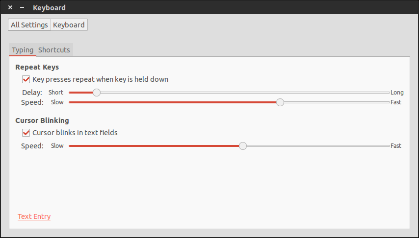

Postinstall
===========

Here's some things you need to do manually:

notify-osd
----------

Run `NotifyOSDConfiguration` and choose "Dynamic" under "Positioning", tick
"Close Bubble on Click" and change the "Timeout" to "2 sec".

numix-icon-theme
----------------

Run Unity Tweak Tool. Under section `Theme`, select to `Numix`. Under section
`Icons`, select `Numix-circle`.

gnome-terminal
--------------

Under `Edit > Keyboard Shortcuts...` change `Tabs > Switch to Previous Tab` and
`Tabs > Switch to Next Tab` to `Shift+Left` and `Shift+Right`, respectively.

keyboard-delay
--------------

Under `Settings > Keyboard > Typing`, change the sliders to match the following:



dropbox
-------

To set up Dropbox with your account, run:

```bash
~/.dropbox-dist/dropboxd
```

and follow the instructions that pop up.
